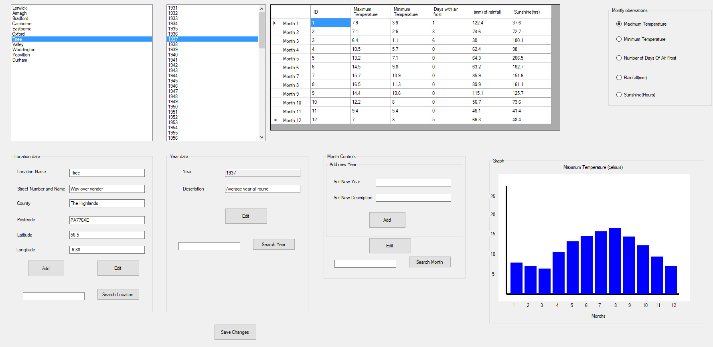

Coursework for module soft151. The task was to develop a program in C# which receives a .txt as an input and displays it for the end user. The end user should be able to edit and search the data sets. Grade recieved 83.50%.

